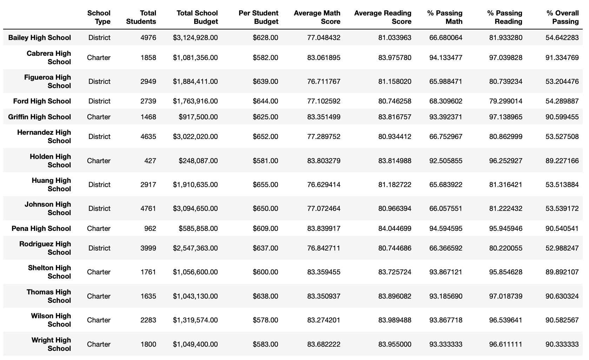

# School District Analysis

## Overview of Analysis

The city school district requires to prepare all standardized test data for analysis, reporting and presentation. The outcome will be used to provide insights about performance trends and patterns for its schools. These insights will be taken into discussions and help in making strategic decisions regarding school budgets/priorities at the school/district levels by the school board and superintendent.

After the initial analysis, there was a report of academic dishonesty with evidence for the ninth grade in Thomas high school. With this in consideration an additional analysis was required with 7 key metrics excluding Thomas high school ninth grade for reading and math. As part of the analysis one additional requirement was to understand the impact of this exclusion to the metrics.

## Resources
- Data Source: students_complete.csv, schools_complete.csv
- Software: Python 3.9.7, Jupyter Notebook

---

## School District Performance Results

Below are the details of the analysis on how the metrics were impacted with the exclusion of the 9th grade assessments in Thomas High School. To represent the changes below its classified as before and after correction showing how the metrics looked before and how it changed after removing 9th grade scores.

1. District Summary: Though there were changes the affect due the the change were minimal. Details as below:
    - Average math score reduced from 78.9 to 79
    - Average reading score remained at 81.9
    - Percentage passing math decreased from 75% to 74.8%
    - Percentage passing reading decreased from 86% to 85.7%
    - Overall passing percentage decreased from 65% to 64.9%

When     |  District Summary Without Rounding
:-------------------------:|:-------------------------:
Before Correction   |  
After Correction   |  

When     |  District Summary Rounded
:-------------------------:|:-------------------------:
Before Correction   |  
After Correction   |  

2. School Summary: As this is per school, there was no change to the scores for other schools. Below are the details of the changes that happened in Thomas High School.
- Below is the summary before any changes were made

- After excluding Thomas High School 9th graders there was a signifcant dip in the scores as the passing percentage was based on the students including 9th graders. Here for example the overall passing percent dipped from 90.9% to 65.1%
 
- To fix that the student count of Thomas High School, for the passing percentage the 9th grade count was skipped to get the below result. The change is now minimal like overall passing percentage shows it reduced from 90.9% to 90.6%. 

- Below is the updated overall school summary

3. With the updated scores below were top and bottom schools. Though there was a dip in overall score for Thomas high school it still maintained its second place. The difference between the 2nd place and 3rd place reduced from 0.35% to 0.03%.

- Top 5 Schools Before Correction

- Top 5 Schools After Correction

- Bottom 5 Schools Before Correction

- Bottom 5 Schools After Correction
 

4. The average math and reading score for each grade level from each school did not change at all except for the fact that 9th grade thomas high school is marked as NaN now.

Type |Before Correction     |  After Correction
:-------------------------:|:-------------------------:|:-------------------------:
Math Scores |     | 
Reading Scores |     | 

5. Scores by school spending per student: This also had minimal impact. As Thomas High School in the range of $631 to $645, there were small changes to the scores for this group. While at a rounded level there was no difference, there were minimal changes to the scores that can be seen with higher precision.

When     | Scores by School Spending Without Rounding
:-------------------------:|:-------------------------:
Before Correction   |  
After Correction   |  

When     |  Scores by School Spending Rounded
:-------------------------:|:-------------------------:
Before Correction   |  
After Correction   |  

6. Scores by school size: This also had minimal impact. As Thomas High School size was classified as Medium, there were small changes to the scores for this group. While at a rounded level there was no difference, there were minimal changes to the scores that can be seen with higher precision.

When     | Scores by School Size Without Rounding
:-------------------------:|:-------------------------:
Before Correction   |  
After Correction   |  

When     |  Scores by School Size Rounded
:-------------------------:|:-------------------------:
Before Correction   |  
After Correction   |  

7. Scores by school type: This also had minimal impact. As Thomas High School type was classified as Charter, there were small changes to the scores for this group. While at a rounded level there was no difference, there were minimal changes to the scores that can be seen with higher precision.

When     | Scores by School Type Without Rounding
:-------------------------:|:-------------------------:
Before Correction   |  
After Correction   |  

When     |  Scores by School Type Rounded
:-------------------------:|:-------------------------:
Before Correction   |  
After Correction   |  

---

## School District Performance Summary

Below are the summarized changes after the correction of removing 9th grade scores from the analysis

- Overall passing percentage decreased from 65% to 64.9% at District Level
- The overall school performance reduced by 0.32% making it closed to the 3rd place school but still continued at 2nd Place
- Math and Reading Scores for Thomas High School 9th grade was completely removed.
- There were only very minimal changes for scores related to
    - School Spending Per Student under $630 to $645
    - School Size of medium
    - School Type of charter